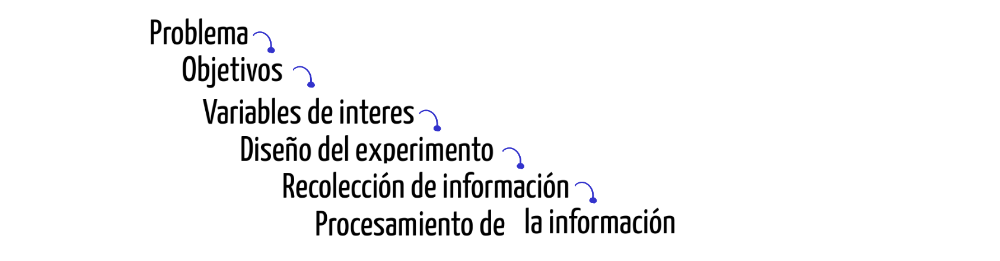
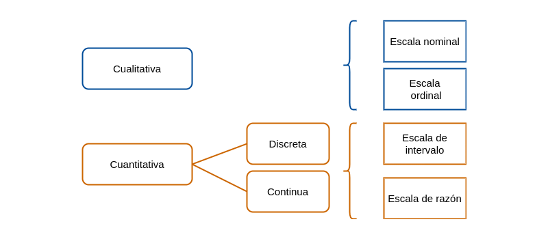

```{r setup, include=FALSE}
options(htmltools.dir.version = FALSE)
knitr::opts_chunk$set(
  fig.width=9, fig.height=3.5, fig.retina=3,
  out.width = "100%",
  cache = FALSE,
  echo = TRUE,
  message = FALSE, 
  warning = FALSE,
  hiline = TRUE
)
library(knitr)

```

```{r xaringan-themer, include=FALSE, warning=FALSE}
library(xaringanthemer)
style_duo_accent(
  primary_color = "#295982",        # gris ??   
  secondary_color = "#6FABD0",      # amarillo
  inverse_header_color = "#D7F0E9"  # blanco
)
```

class: inverse, center, middle
background-image: url(img/p1.png)  /* imagen de fondo */
background-size: 100% 100%
background-position: center

# Seminario Análisis de tendencia para métodos cualitativos y cuantitativos
### Pontificia Universidad Javeriana Cali
### 2023

---
background-size: 100% 100%
background-position: center

# Profesores a cargo del seminario


---
class:  
background-image: url(img/p2.png)  /* imagen de fondo */
background-size: 100% 100%
background-position: center

# Contenido

 
---
background-image: url(img/p2.png)  /* imagen de fondo */
background-size: 100% 100%
background-position: center

# Metodología Estadística
## Unidad 1

.pull-left[
### Temática

*   Introducción a la calidad de la información
*   Fuentes de información
*   Variables cualitativas y cuantitativas
*   Identificación de errores y sesgos en la información
]

.pull-right[

### Metodología Estadística

1.  Definición del problema
1.  Definición de los objetivos
1.  Definición de las variables de interés
1.  Diseño del experimento
1.  Reccolección de la información
1.  Procesamiento de datos
]

---
class: 
background-image: url(img/p2.png)  /* imagen de fondo */
background-size: 100% 100%
background-position: center

# Introducción a la calidad de la información

## Que es CALIDAD 

"La calidad es la conformidad con los requisitos" <br/>
Philip B. Crosby

--

 

---
class: 
background-image: url(img/p2.png)  /* imagen de fondo */
background-size: 100% 100%
background-position: center

## Que es CALIDAD DE LA INFORMACIÓN 

Es la medida en que la información es **precisa**, **relevante**, **confiable**, **oportuna** y **útil** para su propósito previsto. En el contexto de la gestión de datos y la toma de decisiones, la calidad de la información es esencial para asegurar que la información proporcionada sea valiosa y efectiva para quienes la utilizan.

<br/><br/>

--
Es **necesario conocer que es lo que hacemos** para determinar si los datos cumplen con nuestros propositos:

<br/><br/>
--



---
background-image: url(img/p2.png)  /* imagen de fondo */
background-size: 100% 100%
background-position: center

# Definición del problema

El planteamiento del problema puede tener varios orígenes, entre los cuales podemos mencionar: 

* Inquietud personal por resolver un problema
* Lluvia de ideas de un grupo de personas
* Solicitud realizada por entidad externa, empresa o persona

--

<br/>

Se recomienda en este caso iniciar con una **revisión bibliográfica** que permitan a los interesados buscar grupos de personas que enfrentan problemas similares, que tipo de soluciones ha propuesto o están implementando.  Es posible que el problema al que nos enfrentamos ya tenga una buena solución y por tanto no tendría sentido destinar una serie de recursos para estudiar lo que ya otros tienen solucionado. 

--

En caso de tratarse de un problema con cierta frecuencia pero con **características muy particulares**, es necesario además de la revisión bibliográfica determinar:

* Antecedente
* Preguntas de investigación
* Hipótesis de investigación 
* Justificación del estudio
* Delimitación del problema

---
class: 
background-image: url(img/p2.png)  /* imagen de fondo */
background-size: 100% 100%
background-position: center

# Definición del problema - continuación

### Ejemplos : 

* Aumento de embarazos de adolescentes en Colombia durante la última década
* Incremento de los suicidios en adolescentes durante los últimos cinco años en Colombia
* Incremento de los homicidios en el Valle del Cauca en jóvenes entre 18 y 28 años
* ...

--

### Plantea un problema

---
class: 
background-size: 100% 100%
background-position: center

# Definición de los objetivos

Al iniciar una investigación uno de los primeros pasos debe ser el definir de la forma más  **clara**  el  propósito u objetivo principal del estudio. Estos deben de estar **orientados a la solución del problema**


--

<br/>

Los objetivos pueden ser:

* **Generales**: definen  a  grandes  rasgos  el  propósito  del trabajo de  investigación.

* **Específicos**: definen  en  detalle  los  fines  de  la  investigación. Cuanto  más  detallado  sean  los  objetivos específicos más fácil será planear  las  etapas  para  lograrlos.


* Algunos verbos utilizados para la especificación de los objetivos son: determinar, identificar, evaluar, analizar, comparar, examinar, proponer, validar, estimar, formular, .....

---
class: 
background-image: url(img/p2.png)  /* imagen de fondo */
background-size: 100% 100%
background-position: center

# Definición del objetivos - continuación

### Ejemplos : 

* Determinar los principales factores que han incidido en el aumento de la violencia en Colombia
* Identificar las principales causas de homicidios en Cali
* Establecer los principales factores que inciden en la elección de la carrera universitaria
* ...

--

<br/><br/>

### Plantea un objetivo

---
class: 
background-image: url(img/p2.png)  /* imagen de fondo */
background-size: 100% 100%
background-position: center

# Definición de las variables de interés


--

<br/><br/>

 ## Variables cualitativas  $\hspace{5cm}$ Variables cuantitativas


---
class: 
background-image: url(img/p2.png)  /* imagen de fondo */
background-size: 100% 100%
background-position: center



--

<br/><br/>

Las variables se pueden clasificar según :
 
* **origen** : aleatorias, no aleatorias
* **su naturaleza** : cualitativas, cuantitativas (discretas, continuas)
* **su relación con otras variables**  : dependientes, independientes


---
class: 
background-image: url(img/p2.png)  /* imagen de fondo */
background-size: 100% 100%
background-position: center

# Variables cualitativas - escala nominal
Los valores son categorías no comparables, sin presencia de orden jerárquico distinto al alfabético entre ellos. Al comparar dos valores solo es posible afirmar que son iguales o que son diferentes  (=, $\neq$).

#### Ejemplo:

* Estado civil, (soltero, casado, unión libre, separado, viudo)
* Profesión (ingeniero, arquitecto, químico, médico, administrador....)
* Nacionalidad ( colombiano, venezolano, ecuatoriano....)
* Grupo sanguíneo (A, B, AB, O)
* ...
--

<br/><br/>

### Plantea una variable cualitativa en escala nominal


---
class: 
background-image: url(img/p2.png)  /* imagen de fondo */
background-size: 100% 100%
background-position: center

# Variables cualitativas - escala ordinal

Los valores son categorías comparables, en el sentido de que se pueden ordenar de menor a mayor o a la inverda. (=, $\neq$, <, >) cualitativa.

#### Ejemplo

* Considera que el servicio que acaba de recibir es:
  * $\square$  Excelente,
  * $\square$  Muy bueno,
  * $\square$  Bueno, 
  * $\square$  Regular,
  * $\square$  Muy regular,
  * $\square$  Pésimo  
--

<br/><br/>

### Plantea una variable cualitativa en escala ordinal

---
class: 
background-image: url(img/p2.png)  /* imagen de fondo */
background-size: 100% 100%
background-position: center

# Variables cuantitativas - escala de intervalo

orresponde a valores numéricos, dentro de los cuales solo tiene sentido la diferencia entre dos de sus valores. (=, $\neq$, < , > , -)

#### Ejemplo

**Temperatura**  La variable se puede medir en diferentes tipos de escalas :

  * Celsius $^{\circ} C$, (La escala Celsius fue creada  Andrés Celsius (1742) . Esta escala  tiene como referencia los puntos de congelación y ebullición del agua, límites que divide en 100 partes iguales
  
  * Kelvin $K$, Creada por William Thompson Kelvin (1848), en la que propone una transformación de la escala Celsius hasta un valor  hipotético en el que hay ausencia de calor.
  
  * Fahrenheit $^{\circ}F$  Escala propuesta Gabriel Daniel Fahrenheit (1724), proponiendo una modificación a la escala Celsius
--
<br/>

T = 0 $^{\circ} C$
* K = x $^{\circ}C$ + 273.15   = 273.15 $^{\circ}F$
* F = x $^{\circ}C$ \times 9/5+ 32  = 32 $^{\circ}F$

---

En ocasiones variables de tipo **cualitativo** no observables de manera directa como :

* Clima laboral
* Estrés
* Inteligencia
* Nivel de desempeño
* Calidad
* ...

Con frecuencia a las variables anteriores se les llama variables latentes debido a que su medición no es directa, sino que se realiza a través de preguntas que se recogen en un instrumento en muchos casos agrupados por factores. Cada respuesta en las preguntas tiene un valor o puntaje que es sumado y determina los niveles de la variable.  Los valores dados  a  las respuestas pueden cambiar de instrumento a instrumento, pues existen escalas con 3 valores, otras con 5, 7 que que pueden representar una escala ordinal. 

A esta transformación numérica (suma de los puntajes obtenidos al totalizar los puntajes obtenidos) se conoce como **operacionalización** a escala de intervalo de una variable cualitativa.  


<br/><br/>

### Plantea una variable cuantitativa en escala intervalo


---
class: 
background-image: url(img/p2.png)  /* imagen de fondo */
background-size: 100% 100%
background-position: center

# Variables cuantitativas - escala de razón

Corresponde a valores  numéricos, para los cuales además de las diferencias también tiene sentido la razón de dos de sus valores. (=, $\neq$, < , > , -, \)


#### Ejemplo

* Ingresos mensuales de una persona
* Cantidad de calorias que consume una persona diariamente
* Peso de un paciente
* Talla de un niño recien nacido
* Edad de una persona al morir
* ...
--

<br/><br/>

### Plantea una variable cuantitativa en escala razón

---
class: 
background-image: url(img/p2.png)  /* imagen de fondo */
background-size: 100% 100%
background-position: center

# Diseño del estudio

Después de tener claro los tres puntos anteriores, es necesario diseñar y prever todas las actividades necesarias para la recolección de la información requerida para el cumplimiento de los objetivos propuestos. Esta parte comprende definir:
		
+ Tipo de estudio
+ Tipo de muestreo (en caso de requerirlo)
+ Tamaño de la muestra

--
### Tipo de estudio

* Experimental
  * Experimento puro
  * Cuasi-experimento
* No experimental
  * Transeccional 
  * Exploratorio
    * Descriptivo de uno o más grupos
    * Longitudinal
    * De tendencia
    * De evolución de grupo


---
class: 
background-image: url(img/p2.png)  /* imagen de fondo */
background-size: 100% 100%
background-position: center

# Experimental

## Experimento puro

## Cuasi-experimento

---
class: 
background-image: url(img/p2.png)  /* imagen de fondo */
background-size: 100% 100%
background-position: center

# No experimental

## Transeccional


## Exploratorio

---
class: 
background-image: url(img/p2.png)  /* imagen de fondo */
background-size: 100% 100%
background-position: center

# Algunos conceptos básicos

## Población - Censo - Parámetro

* **Población**: Conjunto de elementos acerca de los cuales deseamos realizar alguna inferencia.
* **Censo**: Estudio que incluye todos los elementos de una población. 

## Muestra  -  Muestreo -  Estimador

* **Muestra**: Subconjunto de elementos una población, elegidos de un marco muestral. 
* **Muestreo**: Forma de selección de una parte de la población. 
* **Marco muestral**: Listado completo de unidades que conforman una población. 
* **Unidad de muestreo** Persona  u  objeto  de  la cual  se toma  la  información. 
--

<br/>

* **Tipo de muestreo**
  * Muestreo probabilistico
  * Muestreo no probabilistico
  
  
---
class: 
background-image: url(img/p2.png)  /* imagen de fondo */
background-size: 100% 100%
background-position: center

# Tipo de muestreo

* Muestreo probabilística
  * Muestreo aleatorio simple 
  * Muestreo aleatorio estratificado
  * Muestreo aleatorio por conglomerados
  * Muestreo sistemático
  * Muestreo compuestos

<br/>

* Muestreo no  probabilística
  * Muestreo por conveniencia
	* Muestreo por juicio
	* Muestreo por cuotas
	*  Muestreo bola de nieve
---
class: 
background-image: url(img/p2.png)  /* imagen de fondo */
background-size: 100% 100%
background-position: center


---
class: 
background-image: url(img/p2.png)  /* imagen de fondo */
background-size: 100% 100%
background-position: center

.pull-left[

## 


]

.pull-right[


## 
]
---
class: 
background-image: url(img/p2.png)  /* imagen de fondo */
background-size: 100% 100%
background-position: center


---
class: 
background-image: url(img/p2.png)  /* imagen de fondo */
background-size: 100% 100%
background-position: center


---
class: 
background-image: url(img/p2.png)  /* imagen de fondo */
background-size: 100% 100%
background-position: center


---
class: 
background-image: url(img/p2.png)  /* imagen de fondo */
background-size: 100% 100%
background-position: center


---
class: 
background-image: url(img/p2.png)  /* imagen de fondo */
background-size: 100% 100%
background-position: center


---
class: 
background-image: url(img/p2.png)  /* imagen de fondo */
background-size: 100% 100%
background-position: center


---
class: 
background-image: url(img/p2.png)  /* imagen de fondo */
background-size: 100% 100%
background-position: center


---
class: 
background-image: url(img/p2.png)  /* imagen de fondo */
background-size: 100% 100%
background-position: center


---
class: 
background-image: url(img/p2.png)  /* imagen de fondo */
background-size: 100% 100%
background-position: center


---
class: 
background-image: url(img/p2.png)  /* imagen de fondo */
background-size: 100% 100%
background-position: center


---
class: 
background-image: url(img/p2.png)  /* imagen de fondo */
background-size: 100% 100%
background-position: center


---
class: 
background-image: url(img/p2.png)  /* imagen de fondo */
background-size: 100% 100%
background-position: center


---
class: 
background-image: url(img/p2.png)  /* imagen de fondo */
background-size: 100% 100%
background-position: center


---
class: 
background-image: url(img/p2.png)  /* imagen de fondo */
background-size: 100% 100%
background-position: center


---
class: 
background-image: url(img/p2.png)  /* imagen de fondo */
background-size: 100% 100%
background-position: center


---
class: 
background-image: url(img/p2.png)  /* imagen de fondo */
background-size: 100% 100%
background-position: center

# Recolección de la información


---
class: 
background-image: url(img/p2.png)  /* imagen de fondo */
background-size: 100% 100%
background-position: center

# Procesamiento de la información


---
class: inverse, center, middle
background-image: url(img/p1.png)  /* imagen de fondo */
background-size: 100% 100%
background-position: center


# **Gracias!**


---
class: inverse, center, middle
background-image: url(img/p1.png)  /* imagen de fondo */
background-size: 100% 100%
background-position: center


