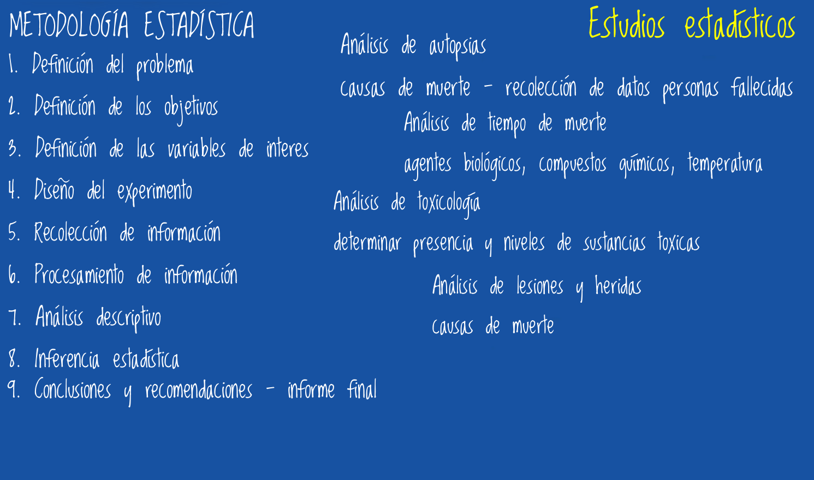
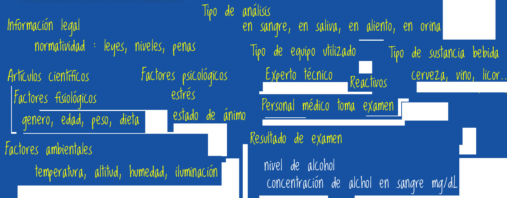
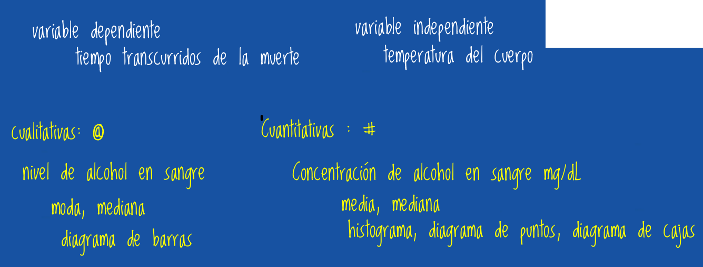
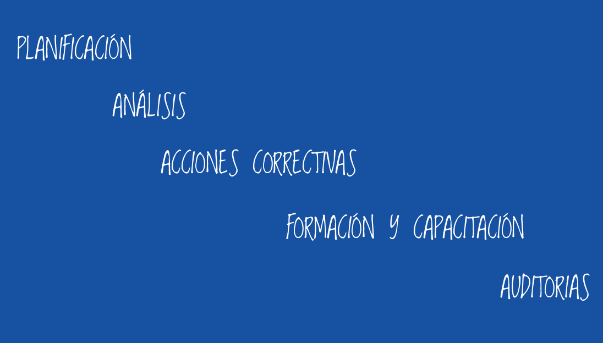

```{r setup, include=FALSE}
options(htmltools.dir.version = FALSE)
knitr::opts_chunk$set(
  fig.width=9, fig.height=3.5, fig.retina=3,
  out.width = "100%",
  cache = FALSE,
  echo = TRUE,
  message = FALSE, 
  warning = FALSE,
  hiline = TRUE
)


```

```{r xaringan-themer, include=FALSE, warning=FALSE}
library(xaringanthemer)
style_duo_accent(
  primary_color = "#295982",        # gris ??   
  secondary_color = "#6FABD0",      # amarillo
  inverse_header_color = "#D7F0E9"  # blanco
)
```

class: inverse, center, middle
background-image: url(img/p1.png)  /* imagen de fondo */
background-size: 100% 100%
background-position: center

#  **VALIDA TUS DATOS**
### Seminario Análisis de tendencia para métodos cualitativos y cuantitativos
### Pontificia Universidad Javeriana Cali
### 2023

---
background-image: url(img/p2.png)  /* imagen de fondo */
background-size: 100% 100%
background-position: center

# **VALIDA TUS DATOS**

## **Introducción a la calidad de la información**

## **Fuentes de información**.

## **Variables cualitativas y cuantitativas**

## **Identificación de errores y sesgos en la información**
 
---
class: inverse 
background-image: url(img/p4.png)  /* imagen de fondo */

## **Conceptos previos**




---
background-image: url(img/p2.png)  /* imagen de fondo */
background-size: 100% 100%
background-position: center

# **Introducción a la calidad de la información**

### **Calidad de la inforamción**

Hace referencia la medida en que los datos, información y conocimientos proporcionados son:

* precisos
* confiables
* relevantes
* útiles

esenciales para la toma de decisiones y la investigación, 

Existen fuentes de información:

* primarias - información recogida en laboratorio
* secundarias - información contenida en artículos cientificos
* terciarias - información contenida en libros, manuales y reglamentaciones

---
background-image: url(img/p2.png)  /* imagen de fondo */
background-size: 100% 100%
background-position: center

# **Calidad de la información**

### **Precisión**: 

La información precisa es libre de errores y se basa en datos verificables. Los errores pueden surgir de fuentes inexactas, malentendidos o malas interpretaciones.

### **Confiabilidad**: 

La información confiable proviene de fuentes creíbles y se respalda con evidencia sólida. Las fuentes confiables son aquellas con reputación de precisión y objetividad.

### **Relevancia**: 

La información debe ser pertinente para el propósito o la pregunta en cuestión. La información irrelevante puede confundir o distraer.

---

### **Actualidad**: 

La información actualizada es más valiosa que la desactualizada, especialmente en campos que evolucionan rápidamente.

### **Completitud**: 

La información completa proporciona todos los detalles necesarios para comprender el tema en cuestión. La información parcial o incompleta puede llevar a malentendidos.

### **Objetividad**: 

La información debe ser imparcial y libre de sesgos. Los prejuicios pueden distorsionar la calidad de la información.

---

### **Consistencia**: 

La información debe ser coherente en todo su contenido y no entrar en conflicto con datos previamente establecidos o aceptados.

### **Accesibilidad**: 

La información debe estar disponible y ser fácilmente accesible para quienes la necesitan. La falta de accesibilidad puede limitar su utilidad.

### **Claridad**: 

La información debe estar presentada de manera clara y comprensible. El lenguaje confuso o jerga innecesaria puede disminuir la calidad de la información.

### **Verificabilidad**: 

Debe ser posible verificar la información a través de fuentes adicionales o evidencia independiente. La falta de verificabilidad puede generar dudas sobre su calidad.


---
class: inverse
background-image: url(img/p4.png)  /* imagen de fondo */
background-size: 100% 100%
background-position: center

# **Prueba de alcoholemia**

## **Fuentes de información** 




---
class: inverse
background-image: url(img/p4.png)  /* imagen de fondo */
background-size: 100% 100%
background-position: center

# **Prueba de alcoholemia**

## **Variables** 


---
class: inverse
background-image: url(img/p4.png)  /* imagen de fondo */
background-size: 100% 100%
background-position: center
# **Prueba de alcoholemia**

## **Identificación de sesgos y errores**

 
---
class: inverse
background-image: url(img/p4.png)  /* imagen de fondo */
background-size: 100% 100%
background-position: center

# **Como medir para un método de análisis**

## **Presición**

---
class: inverse
background-image: url(img/p4.png)  /* imagen de fondo */
background-size: 100% 100%
background-position: center
## **Exactitud**


---
class: inverse
background-image: url(img/p4.png)  /* imagen de fondo */
background-size: 100% 100%
background-position: center
## **Sensibilidad**

---
class: inverse
background-image: url(img/p4.png)  /* imagen de fondo */
background-size: 100% 100%
background-position: center
## **Especificidad**


---
class: inverse
background-image: url(img/p4.png)  /* imagen de fondo */
background-size: 100% 100%
background-position: center
 # **Implementación de un sistema de gestión de la calidad**



---
class: inverse, center, middle
background-image: url(img/p4.png)  /* imagen de fondo */
background-size: 100% 100%
background-position: center


# **Gracias!**


